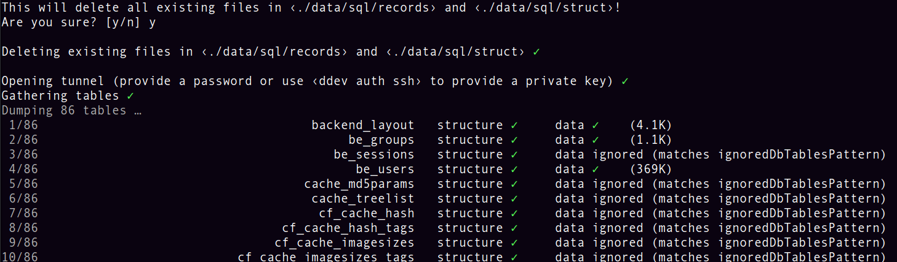

# Dump and deploy SQL from/to remote servers

This adds custom commands which dump or deploy SQL data to/from databases. As database servers are usually not reachable through the internet, it can tunnel its connection through SSH.

## Original intent

This was originally meant as a simple tool to refresh the DDEV database from time to time during feature development with current live data. A fancy interface was built to facilitate adoption with colleagues ;) - the normal workflow would be `ddev dump-db my-remote-live-server; ddev deploy-db ddev`.

It came in handy during TYPO3 upgrades, too when being able to diff SQL data table by table helps facilitate single update steps. This is a controversial topic, but during upgrades I found it helpful to even git the data/SQL together with the code and thus be able to completely undo steps (even if they have side effects on the data) when necessary.

## Installation

Copy [the web/ directory](web/) into your project's .ddev/commands/web.

## Configuration

Without configuration this lets you dump and and deploy the local (called ‹ddev›) database. This might seem redundant to the existing `ddev import-db` and `ddev export-db` commands, but this has a fancy progress indicator and exports each table's data and structure separately...

In roder to add other hosts, see [web/targets/README.txt](web/targets/README.txt) for the config file structure. You basically need SSH and DB connection info. You can use private keys (e.g. via `ddev auth ssh`) or a password prompt to connect.

## Usage

Running `ddev deploy-db` or `ddev dump-db` will show the available host configurations and parameters.

`ddev dump-db` will save the SQL data at ./data/sql/records and ./data/sql/struct.

`ddev deploy-db` also expects .sql files to be in any of these directories. For the ‹ddev› target this is functionally identical to `cat ./data/sql/struct/*.sql ./data/sql/records/*.sql | ddev mysql`.

## Future Plans

It was planned to create siblings for these commands in the form of `dump-files` and `deploy-files`. It was not meant as a replacement for the usual code-deployment process but rather an addition that takes care of user- or editor- created files. This is currently on hold. (There is also a request for this in <https://github.com/drud/ddev/issues/1930)>

## Example

> This is how `ddev dump-db my-host` would look like:

**Original submission from [@jonaseberle](https://github.com/jonaseberle)**
