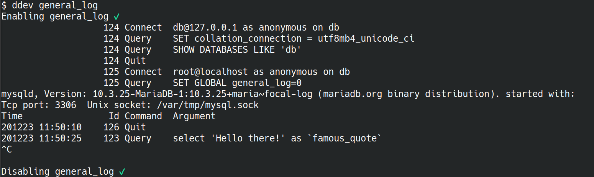

# Enable and show MySQL/MariaDB GENERAL_LOG (ddev general_log)

This custom `ddev` command shows all database queries.

It activates the [MySQL/MariaDB general_log](https://dev.mysql.com/doc/refman/8.0/en/query-log.html) temporarily and de-activates it when it exits.

## Usage

* Run `ddev general_log`
* In order to exit, press `CTRL+C`.

## Example

> After running `ddev general_log` you would see all executed database queries:

## Installation

Copy [the file general_log](general_log) into your project's .ddev/commands/**db**.

**Contributed by [@jonaseberle](https://github.com/jonaseberle)**
