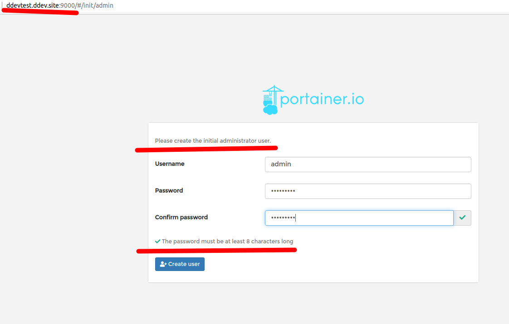
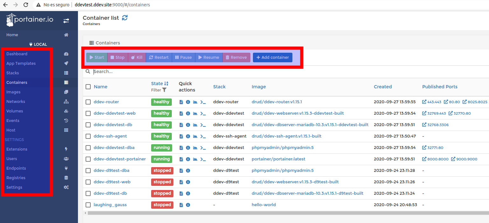

# Portainer Service for DDEV

This recipe allows you to mount a new container in your ddev network with Portainer as new service.

Portainer is a visual mode for management of containers and networks. Is open-source tool that provides a [GUI](https://en.wikipedia.org/wiki/Graphical_user_interface) to facilitate the management of Dockerized environments and by extension, DDEV-based container networks.

* See more about Portainer:
  >  [Repo: github.com/portainer](https://github.com/portainer).

  >  [Docs: portainer.io/documentation](https://www.portainer.io/documentation/).


## Installation and Use

1. Copy [docker-compose.portainer.yaml](docker-compose.portainer.yaml) into your project's .ddev directory.
2. Run `ddev start`.
3. Access to your Portainer Interface using the same project's name, through the ports assigned in the file (9000, 8000 by default), something like: projectname.ddev.site:9000.
4. Create the new admin user of the service writing down a secure password:



5. Access to the reports of your containers and perform actions on them:



6. **Be aware!** Portainer gets data from the Docker socket in your system, so you'll get information about all the existing containers in your environment, so be careful with instructions given to containers, don't make a mistake.


## Connection

Ok, by default you can access to the Portainer interface at the next address from your browser:

```
https://projectname.ddev.site:9000
https://127.0.0.1:9000
```

Cause is the annotated port registered in the config.yaml file. If you want to avoid conflicts, just stop your DDEV-Local network, change the value and relaunch the containers.

Just do:

```
ddev stop
vim docker-compose.portainer.yaml
ports:
  - '3434:9000'
:wq!
ddev start
```
But remember that Portainer always exposes from port 9000, so use this address as destiny in your mapping.

**Contributed by [davidjguru](https://gitlab.com/davidjguru)**, [Drupal Developer](https://www.drupal.org/u/davidjguru) and blogger in [The Russian Lullaby](https://www.therussianlullaby.com/).