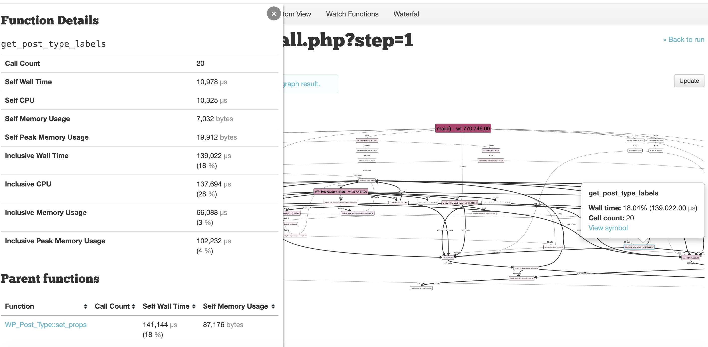

# XHGui

This container provides a [XHGui](https://github.com/perftools/xhgui) container for your project so you can collect performance information
provided by `xhprof`. 




## Warning

This recipe has a dev environment on mind.
Profiling production environments with this recipe is probably not a good idea.

## Installation

### Your DDEV config
You need the `xhprof` php module. The easiest way is adding
```
webimage_extra_packages: [php7.4-xhprof]
```
to your `.ddev/config.yaml` file.

### The containers

* Copy the `docker-compose.xhgui.yml` file to your `.ddev` folder.
* Copy the `xhgui` folder to your `.ddev` folder.
* Copy the `xhgui-mongodb` folder to your `.ddev` folder.
* (Optional) Copy the `commands/xhprof` file to your `.ddev/web/commands` folder, so you can easily start/stop `xhprof`. This probably won't be needed with next ddev release, where you can just do `ddev xhprof on` as you are already used to with xdebug.

### Your application

Your application needs to have a profiler set up.

If your application uses composer, you can install it with

```
ddev composer require perftools/php-profiler (maybe you want to use --dev)
```

For other usecases, see the WordPress section as an example.

You need to place some code for initializing the profiling as soon as possible in the
bootstrap of your application.

In the `examples` folder you will find the collector initialization 
and the config for that collector.

#### Drupal 8+ based projects

An easy way of doing this in Drupal, is copying those two files in the `examples` folder to your
`sites/default` folder, and append to your `settings.ddev.php`.
```
require_once __DIR__ . '/xhgui.collector.php';
```

If you want to stop profiling, you can just comment/remove that line.
Take into account that with the default configuration, every time you 
`ddev start`, DDEV will recreate this file. You can remove the #ddev-generated at the top of the file if you want to avoid that.

#### WordPress projects

Download latest version of `perftools/php-profiler` (this has been validated with the current latest release, 0.18.0).
If you use [bedrock](https://roots.io/bedrock/), just use the composer command from the previous section. 

If you use vanilla WordPress:

```
wget https://github.com/perftools/php-profiler/archive/refs/tags/0.18.0.tar.gz
tar -xvf 0.18.0.tar.gz
```

Copy those two files in the `examples` folder of **this** repo (not the `php-profiler` you just downloaded) to your
WordPress folder, and append to your `wp-config-ddev.php`:

```
require_once __DIR__ . '/php-profiler-0.18.0/autoload.php';
require_once __DIR__ . '/xhgui.collector.php';
```

If you want to stop profiling, you can just comment/remove those lines.
Take into account that with the default configuration, every time you 
`ddev start`, DDEV will recreate this file. You can remove the #ddev-generated at the top of the file if you want to avoid that.

### Service initialization

Start (or restart) DDEV to have the service initialized when you are ready: `ddev start`
Remember, `settings.ddev.php` or `wp-config-ddev.php` might be rewritten and you need to do changes there.

### Accessing the service

By default, xhgui will be available at  http://`<your site>`:8282. Note that it's http only.


**Contributed by [@penyaskito](https://github.com/penyaskito)**

**Help and feedback from**  [@randyfay](https://github.com/randyfay), [@e0ipso](https://github.com/e0ipso), [@andypost](https://github.com/andypost) 
